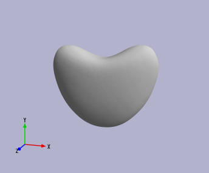
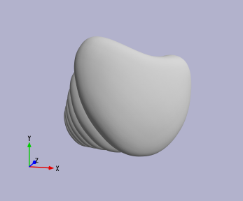
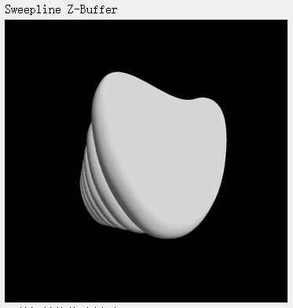
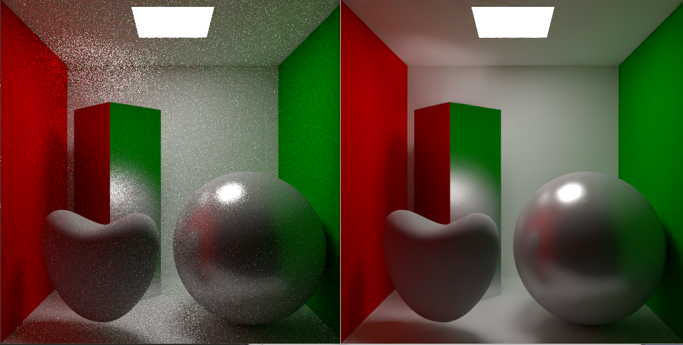
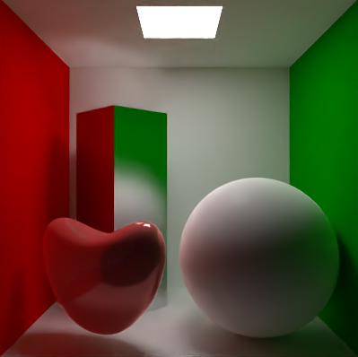
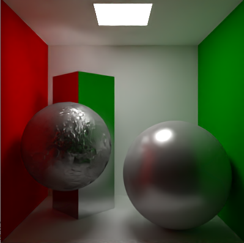
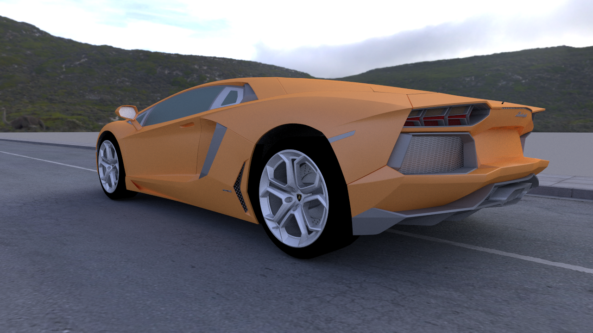
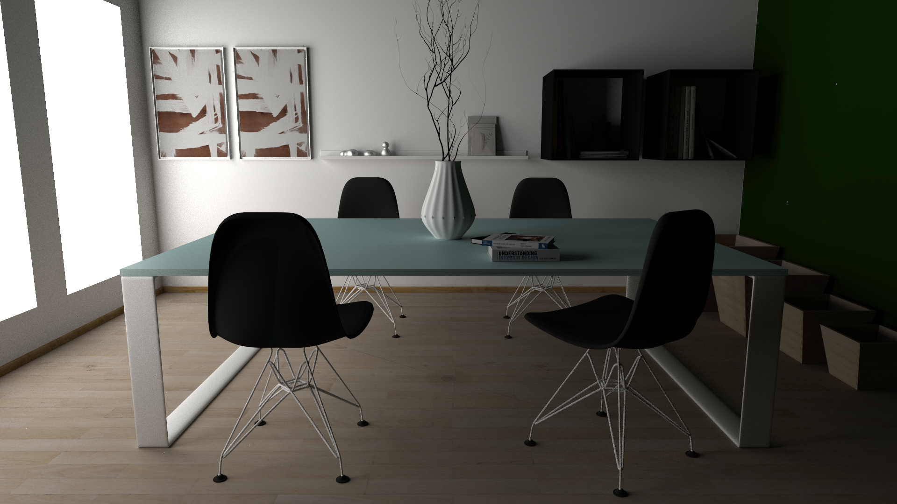
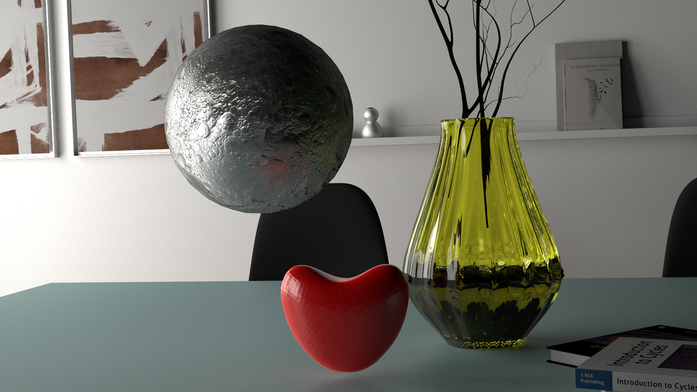

### 简介
`MyCGLab`是一款带有路径追踪离线渲染、简易Cad功能、表面细分、软光栅渲染等特性的图形学多功能实验平台。

### 编译
编译前，请确保具有以下环境：

- CMake(>= 3.10)
- 支持C++17的编译器
- Qt(>= 5.0)
- OptiX(>= 7.0)用于支持AI Denoiser(可选)

### 使用说明
MyCGLab主要基于命令行控件进行交互，每个命令以`;`结尾，在命令行控件中输入`help;`命令并回车获取更多信息。
软件中已经内置多种脚本，请打开菜单栏中的`Script List`查看，每个脚本都有其附带的命令与说明

> 使用内置脚本前，将源文件目录下的example-scenes文件夹移动至软件可执行程序所在目录。

> 注意：由于软件开发的不完善，若已经执行了其他命令，内置脚步可能出错，此时请重启软件

#### 摄像机交互方式

|操作|效果|
|---|---|
|鼠标左键按住并拖动|旋转视角|
|滑动鼠标滚轮|缩放|
|按下w键|前进|
|按下s键|后退|
|按下a键|向左|
|按下d键|向右|

### 特性展示

以下例子都能通过软件自带脚本复现

#### CAD+曲面细分

通过简易CAD操作+曲面细分构建心形体

#### 软光栅

使用软光栅绘制之前构建的心形体
OpenGL绘制效果：

扫描线算法绘制效果：

#### 路径追踪

路径追踪渲染CornellBox场景，25spp，使用了基于OptiX的AI Denioser

#### Disney Brdf

对心形体和球体设置Disney材质

#### BumpMap

绘制带有BumpMap的场景

### 其他案例

### 详细说明
#### 离线渲染部分详细说明

路径追踪渲染器模块，主要有以下特性：

- 基于openmp的并行
- 内置Blinn-Phong, Disney BRDF等多种材质，并易于扩充
- 基于OcTree的加速
- 支持Bump Map
- 基于OptiX的AI降噪

离线渲染部分主要命令如下：

|命令|说明|例子|
|-----|-----|----|
|loadObj [PATH]|导入obj场景文件|loadObj "./example-scenes/car/car.obj"|
|set samplePerPixelDim [NUM_INT]|设置每像素每维度的样本数|set samplePerPixelDim 8|
|set threadNum [NUM_INT]| 设置绘制线程数 | set threadNum 8|
|raytrace|启动离线渲染|
|saveBmp [PATH]|保存当前渲染结果至bmp文件|saveBmp "./car_blinnphong_complete.bmp"|
|setMaterial [ID_INT]|为编号为[ID]的对象打开材质设置界面|setMaterial 7|
|setMaterial [ID_INT] [MATERIALTYPE_STRING] [PARAMETERS]|将编号为[ID]的对象的材质设置为指定类型、指定参数，具体类型和参数列表可在前述材质设置界面中查看，贴图路径需用""进行约束|setMaterial 0 Disney 0,0,0 "./texture/base_color.jpg" 0.1 "" 0.4 "" 0.8 "" 0.4 "" 0.3 "" 0 "" 0.2 ""|
|setSkybox [PATH]|设置天空盒|setSkybox "./example-scenes/car/environment_day.hdr"|
|setLookAt [POSITION_POINT] [UP_VECTOR] [CENTER_POINT]|设置摄像机LookAt矩阵|setLookAt 8.22,-0.61,-9.80 -0.065,0.996,0.065 7.514,-0.702,-9.097|
|printLookAt|打印目前的摄像机坐标||
|setFov [FLOAT]|设置Fov（角度制）|setFov 45|
|resize [X_INT] [Y_INT]|设置渲染图片大小|resize 1280 720|

#### 简易CAD部分详细说明

主要实现了5种欧拉操作以及扫成操作，命令如下：

|命令|说明|例子|
|-----|-----|----|
|mvfs [COORD_POINT]|创建新点、面、体|mvfs 0,0,0.9|
|mev [VertexID_INT] [LoopID_INT] [Coord_POINT]|在环中插入新点|mev 2 3 0,1.1,1|
|mef [VertexID_INT] [VertexID_INT] [LoopID_INT]|分割环，形成新边、面|mef 2 4 5|
|kfmrh [FaceID1_INT] [FaceID2_INT]|删除与面1相接触的一个面2，生成面f1上的一个内环|kfmrh 3 4|
|kemr [LoopID_INT] [HalfEdgeID_INT]|删除一条边e，生成该边某一邻面上的新的内环|kemr 6 7|
|createface [POINT]...|按顺序连接多个点，构成面|createface 0,0,0 0,0,0.5 0,1.0,1.0|
|sweep [SolidID_INT] [FaceID_INT] [VECTOR] [FLOAT]|按指定方向和距离，对面进行扫成|sweep 0 5 1,1,1 20|
|toPolygonMesh [SolidID]|CAD实体转多边形网格|toPolygonMesh 4|

#### 曲面细分部分详细说明

主要实现了三种曲面细分算法：

- Doo-Sabin
- Catmull-Clark
- Loop

命令如下：

|命令|说明|例子|
|-----|-----|----|
|DooSabinPolygons [PolygonID_INT] [nLevels_INT]|Doo-Sabin算法细分多边形网格|DooSabinPolygons 2 5|
|CatmullClarkPolygons [PolygonID_INT] [nLevels_INT]|Catmull-Clark算法细分多边形网格|CatmullClarkPolygons 3 6|
|DooSabinTriangles [TriangleID_INT] [nLevels_INT]|Doo-Sabin算法细分三角形网格|DooSabinTriangles 2 5|
|CatmullClarkTriangles [TriangleID_INT] [nLevels_INT]|Catmull-Clark算法细分三角形网格|CatmullClarkTriangles 3 6|
|LoopTriangles [TriangleID_INT] [nLevels_INT]|LoopTriangles算法细分三角形网格|LoopTriangles 3 5|
|triangulatePolygonMesh [PolygonID_INT]|三角化多边形网格|triangulatePolygonMesh 1|

#### 软光栅部分详细说明

实现了三种光栅化算法：

- 扫描线
- 层次z-buffer
- 空间八叉树+层次z-buffer

命令如下：

|命令|说明|例子|
|-----|-----|----|
|softrender|调用软光栅器渲染|/|

#### 其他命令

|命令|说明|例子|
|-----|-----|----|
|clone [PrimitiveID_INT]|克隆指定ID的Primitive|clone 11|
|scale [PrimitiveID_INT] [VECTOR]|缩放指定ID的Primitive|scale 0.5,0.5,0.5|
|rotate [PrimitiveID_INT] [VECTOR] [Degree_FLOAT]|按指定轴旋转指定度数|rotate 2 0,1,0 20|
|translate [PrimitiveID_INT] [VECTOR]|平移指定ID的Primitive|translate 2 1,0,0|
|wireframe [BOOL]|开启/关闭线框显示|wireframe 1|
|cameraZoom [VECTOR]|摄像机视角缩放|cameraZoom 0.5,0.5,0.5|
|cameraRotate [VECTOR] [Degree_FLOAT]|摄像机旋转|cameraRotate 0,0,1 20|
|setLookAt [POSITION_POINT] [UP_VECTOR] [CENTER_POINT]|设置摄像机LookAt向量|setLookAt 0,0,-1 0,1,0 0,0,0|
|printLookAt|打印摄像机当前LookAt向量|/|
|setFov [Degree_FLOAT]|设置摄像机Fov|setFov 60|

#### 参数类型输入格式

|类型|格式|例子|
|-----|-----|----|
|INT|int|7|
|FLOAT|float|0.7|
|VECTOR,POINT|float,float,float|0.2,0.4,0.5|
|STRING|string (without blank)|aaa123|
|PATH|"string"|"./123.txt"|

